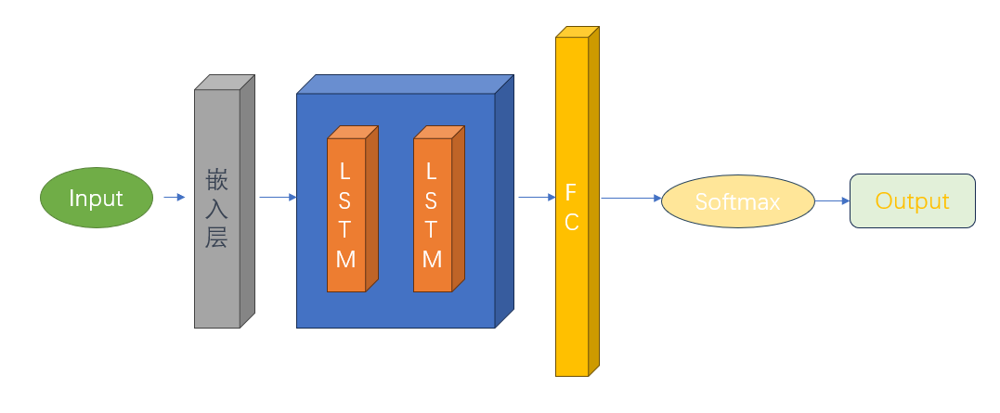
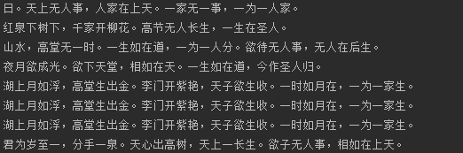

# RNN

[TOC]

## 一：代码：

```python
import collections
from torch.autograd import Variable
import torch.optim as optim
import torch.nn as nn
import torch
import torch.nn.functional as F
import numpy as np


def weights_init(m):
    classname = m.__class__.__name__  #   obtain the class name
    if classname.find('Linear') != -1:
        weight_shape = list(m.weight.data.size())
        fan_in = weight_shape[1]
        fan_out = weight_shape[0]
        w_bound = np.sqrt(6. / (fan_in + fan_out))
        m.weight.data.uniform_(-w_bound, w_bound)
        m.bias.data.fill_(0)


class word_embedding_(nn.Module):
    def __init__(self,vocab_length , embedding_dim):
        super(word_embedding_, self).__init__()
        w_embeding_random_intial = np.random.uniform(-1,1,size=(vocab_length ,embedding_dim))
        self.word_embedding = nn.Embedding(vocab_length,embedding_dim)
        self.word_embedding.weight.data.copy_(torch.from_numpy(w_embeding_random_intial))
    def forward(self,input_sentence):
        """
        :param input_sentence:  a tensor ,contain several word index.
        :return: a tensor ,contain word embedding tensor
        """
        sen_embed = self.word_embedding(input_sentence)
        return sen_embed


class RNN_model(nn.Module):
    def __init__(self, batch_sz, vocab_len, word_embedding, embedding_dim, lstm_hidden_dim):
        super(RNN_model, self).__init__()

        self.word_embedding_lookup = word_embedding
        self.batch_size = batch_sz
        self.vocab_length = vocab_len
        self.word_embedding_dim = embedding_dim
        self.lstm_dim = lstm_hidden_dim

        # Define LSTM network
        self.rnn_lstm = nn.LSTM(embedding_dim, lstm_hidden_dim, num_layers=2, batch_first=True)

        self.fc = nn.Linear(lstm_hidden_dim, vocab_len)
        self.apply(weights_init)  # call the weights initial function.

        self.softmax = nn.LogSoftmax(dim=-1)  # the activation function.

    def forward(self, sentence, is_test=False):
        batch_input = self.word_embedding_lookup(sentence).view(1, -1, self.word_embedding_dim)

        # Initialize hidden state and cell state to zero
        h0 = torch.zeros(2, batch_input.size(0), self.lstm_dim).to(batch_input.device)
        c0 = torch.zeros(2, batch_input.size(0), self.lstm_dim).to(batch_input.device)

        # Feed the input to LSTM
        output, _ = self.rnn_lstm(batch_input, (h0, c0))

        out = output.contiguous().view(-1, self.lstm_dim)

        out = F.relu(self.fc(out))

        out = self.softmax(out)

        if is_test:
            prediction = out[-1, :].view(1, -1)
            output = prediction
        else:
            output = out

        return output

class PoemGenerator:
    def __init__(self, file_name, start_token='G', end_token='E', batch_size=64, embedding_dim=100,
                 lstm_hidden_dim=128):
        self.device = torch.device("cuda:0" if torch.cuda.is_available() else "cpu")
        self.file_name = file_name
        self.start_token = start_token
        self.end_token = end_token
        self.batch_size = batch_size
        self.embedding_dim = embedding_dim
        self.lstm_hidden_dim = lstm_hidden_dim
        self.poems_vector, self.word_int_map, self.vocabularies = self.process_poems1(self.file_name)
        self.rnn_model = self.build_model().to(self.device)  # 添加这一行

    def process_poems1(self, file_name):
        poems = []
        with open(file_name, "r", encoding='utf-8', ) as f:
            for line in f.readlines():
                try:
                    title, content = line.strip().split(':')
                    content = content.replace(' ', '')
                    if '_' in content or '(' in content or '（' in content or '《' in content or '[' in content or \
                                    self.start_token in content or self.end_token in content:
                        continue
                    if len(content) < 5 or len(content) > 80:
                        continue
                    content = self.start_token + content + self.end_token
                    poems.append(content)
                except ValueError as e:
                    pass
        poems = sorted(poems, key=lambda line: len(line))
        all_words = []
        for poem in poems:
            all_words += [word for word in poem]
        counter = collections.Counter(all_words)
        count_pairs = sorted(counter.items(), key=lambda x: -x[1])
        words, _ = zip(*count_pairs)
        words = words[:len(words)] + (' ',)
        word_int_map = dict(zip(words, range(len(words))))
        poems_vector = [list(map(word_int_map.get, poem)) for poem in poems]
        return poems_vector, word_int_map, words

    def generate_batch(self):
        n_chunk = len(self.poems_vector) // self.batch_size
        x_batches = []
        y_batches = []
        for i in range(n_chunk):
            start_index = i * self.batch_size
            end_index = start_index + self.batch_size
            x_data = self.poems_vector[start_index:end_index]
            y_data = []
            for row in x_data:
                y  = row[1:]
                y.append(row[-1])
                y_data.append(y)
            x_batches.append(x_data)
            y_batches.append(y_data)
        return x_batches, y_batches

    def build_model(self):
        torch.manual_seed(5)
        word_embedding = word_embedding_(vocab_length=len(self.word_int_map) + 1, embedding_dim=self.embedding_dim)
        rnn_model = RNN_model(batch_sz=self.batch_size, vocab_len=len(self.word_int_map) + 1, word_embedding=word_embedding, embedding_dim=self.embedding_dim, lstm_hidden_dim=self.lstm_hidden_dim)
        return rnn_model

    def run_training(self):
        optimizer = optim.RMSprop(self.rnn_model.parameters(), lr=0.01)
        loss_fun = torch.nn.NLLLoss()
        for epoch in range(50):
            batches_inputs, batches_outputs = self.generate_batch()
            n_chunk = len(batches_inputs)
            for batch in range(n_chunk):
                batch_x = batches_inputs[batch]
                batch_y = batches_outputs[batch]
                loss = 0
                for index in range(self.batch_size):
                    x = np.array(batch_x[index], dtype=np.int64)
                    y = np.array(batch_y[index], dtype=np.int64)
                    x = Variable(torch.from_numpy(np.expand_dims(x, axis=1)).to(self.device))
                    y = Variable(torch.from_numpy(y).to(self.device))
                    pre = self.rnn_model(x)
                    loss += loss_fun(pre, y)
                    if index == 0:
                        _, pre = torch.max(pre, dim=1)
                        print('prediction', pre.data.tolist())
                        print('b_y       ', y.data.tolist())
                        print('*' * 30)
                loss = loss / self.batch_size
                print("epoch  ", epoch, 'batch number', batch, "loss is: ", loss.data.tolist())
                optimizer.zero_grad()
                loss.backward()
                torch.nn.utils.clip_grad_norm_(self.rnn_model.parameters(), 1)

                optimizer.step()

                if batch % 20 == 0:
                    torch.save(self.rnn_model.state_dict(), './poem_generator_rnn')
                    print("finish  save model")

    def to_word(self, predict):
        sample = np.argmax(predict)
        if sample >= len(self.vocabularies):
            sample = len(self.vocabularies) - 1
        return self.vocabularies[sample]

    def pretty_print_poem(self, poem):
        str=''
        poem_sentences = poem.split('。')
        for s in poem_sentences:
            if s != '' and len(s) > 0 and s !='E':
                str=str+s+'。'
        print(str)

    def gen_poem(self, begin_word):
        self.rnn_model.load_state_dict(torch.load('./poem_generator_rnn', map_location=self.device))
        poem = begin_word
        word = begin_word
        while word != self.end_token:
            input = np.array([self.word_int_map[w] for w in poem], dtype=np.int64)
            input = Variable(torch.from_numpy(input)).to(self.device)
            output = self.rnn_model(input, is_test=True)
            word = self.to_word(output.data.tolist()[-1])
            poem += word
            if len(poem) > 50:
                break
        return poem


poem_generator = PoemGenerator('./poems.txt')
#poem_generator.run_training()
poem_generator.pretty_print_poem(poem_generator.gen_poem("日"))
poem_generator.pretty_print_poem(poem_generator.gen_poem("红"))
poem_generator.pretty_print_poem(poem_generator.gen_poem("山"))
poem_generator.pretty_print_poem(poem_generator.gen_poem("夜"))
poem_generator.pretty_print_poem(poem_generator.gen_poem("湖"))
poem_generator.pretty_print_poem(poem_generator.gen_poem("湖"))
poem_generator.pretty_print_poem(poem_generator.gen_poem("湖"))
poem_generator.pretty_print_poem(poem_generator.gen_poem("君"))

##result:
# 日。天上无人事，人家在上天。一家无一事，一为一人家。
# 红泉下树下，千家开柳花。高节无人长生，一生在圣人。
# 山水，高堂无一时。一生如在道，一为一人分。欲待无人事，无人在后生。
# 夜月欲成光。欲下天堂，相如在天。一生如在道，今作圣人归。
# 湖上月如浮，高堂生出金。李门开紫艳，天子欲生收。一时如月在，一为一家生。
# 湖上月如浮，高堂生出金。李门开紫艳，天子欲生收。一时如月在，一为一家生。
# 湖上月如浮，高堂生出金。李门开紫艳，天子欲生收。一时如月在，一为一家生。
# 君为岁至一，分手一泉。天心出高树，天上一长生。欲子无人事，相如在上天。
```

## 二：分析与结论：


### 1）模型设计：



### 2）代码结构说明：

#### 1. 概述：

本项目包含了一个基于长短期记忆网络（LSTM）的自动诗词生成模型，主要利用 Python 的深度学习框架 PyTorch 来实现。该模型可以根据给定的起始字符自动生成一首诗。

#### 2. 项目结构

主要的模型代码包含在一个 Python 文件中，该文件包含以下几个主要部分：

- **词嵌入层（word_embedding_ 类）**
- **LSTM 层（RNN_model 类）**
- **诗词生成器（PoemGenerator 类）**

#### 3. 详细说明

##### 3.1 词嵌入层（word_embedding_ 类）

词嵌入层负责将输入的单词索引转换为嵌入向量。这一过程通过 nn.Embedding 类实现，该类首先初始化一个随机的嵌入矩阵，然后在训练过程中优化这个嵌入矩阵。

##### 3.2 LSTM 层（RNN_model 类）

这部分包含一个双层 LSTM 网络，以及一个全连接层。LSTM 网络接收一个批次的词嵌入向量，然后在每个时间步更新其隐藏状态。全连接层接收 LSTM 的隐藏状态，并将其转换为一个打分向量，该向量的大小等于词汇表的大小，代表了每个单词被预测为下一个单词的分数。

##### 3.3 诗词生成器（PoemGenerator 类）

诗词生成器负责处理诗词数据，训练 LSTM 模型，生成诗句，以及保存和加载模型参数。其中：

- **处理诗词数据**：该步骤包括读取诗词数据，将每首诗词转换为一个词索引的序列，以及构建词汇表和词索引映射。
- **训练 LSTM 模型**：该步骤使用 RMSProp 优化器和 NLLLoss 损失函数，通过反向传播和梯度下降的方法训练 LSTM 模型。
- **生成诗句**：给定一个起始字符，该步骤使用训练好的 LSTM 模型生成一首诗。
- **保存和加载模型参数**：该步骤可以将训练好的 LSTM 模型参数保存到磁盘，以便于以后重新加载并使用。

#### 4. 使用说明

首先，需要创建一个 PoemGenerator 对象，并传入诗词数据文件的路径：

```python
poem_generator = PoemGenerator('./poems.txt')
```

然后，可以调用 `run_training` 方法来训练模型：

```python
poem_generator.run_training()
```

该方法将会运行50个训练周期，并在每20个批次后保存一次模型的状态。

完成训练后，你可以使用 `gen_poem` 方法生成诗句。你只需要提供一个起始字符，该方法会返回一个自动生成的诗句：

```python
pythonCopy codepoem = poem_generator.gen_poem("日")
print(poem)
```

如果你希望生成的诗句更加美观，你可以使用 `pretty_print_poem` 方法来生成并打印诗句：

```python
pythonCopy code
poem_generator.pretty_print_poem(poem_generator.gen_poem("日"))
```

另外，如果你需要重新加载已经训练好的模型，你可以使用 PyTorch 的 `load_state_dict` 方法：

```python
pythonCopy code
self.rnn_model.load_state_dict(torch.load('./poem_generator_rnn', map_location=self.device))
```

### 3）结果展示：



### 4）结论：

​			天行大道，地合九坤。这次实验是目前遇到的实验中最最最难的一个，首先它的第一个难点在于对数据的处理方面。他要将数据处理成一个序列，我是可以理解的，但是在lstm的输入中它要求一个三维的tensor，我是不知到为什么，纠结了三天三夜的时间，终于想明白了，他是要并行计算的，我草。其次是嵌入层，不知道这个搞来干嘛，有点莫名其妙。不过这个查了一下就了解了，这个是来进行编码的。 

​            天行健，吾在下。经过无数次的尝试和失败，通过对问题的深度分析和理解，我终于攻克了各个难题。虽然过程曲折，但是当我看到模型成功地生成出诗句的时候，我知到：“i am winner”。其它的也没什么好说的，但是就一句话：“困难虽然有，但是可以克服”
